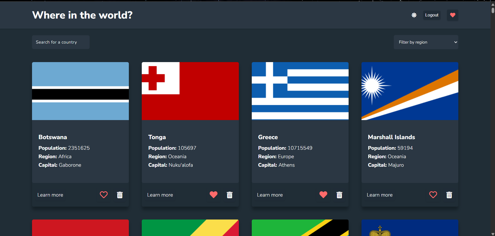
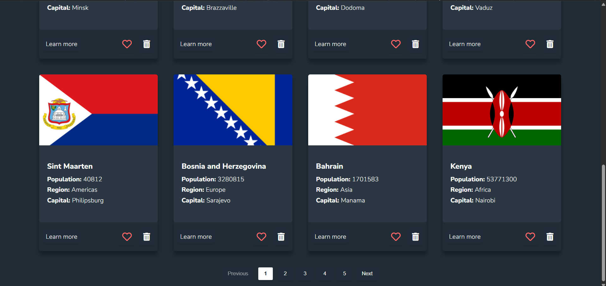
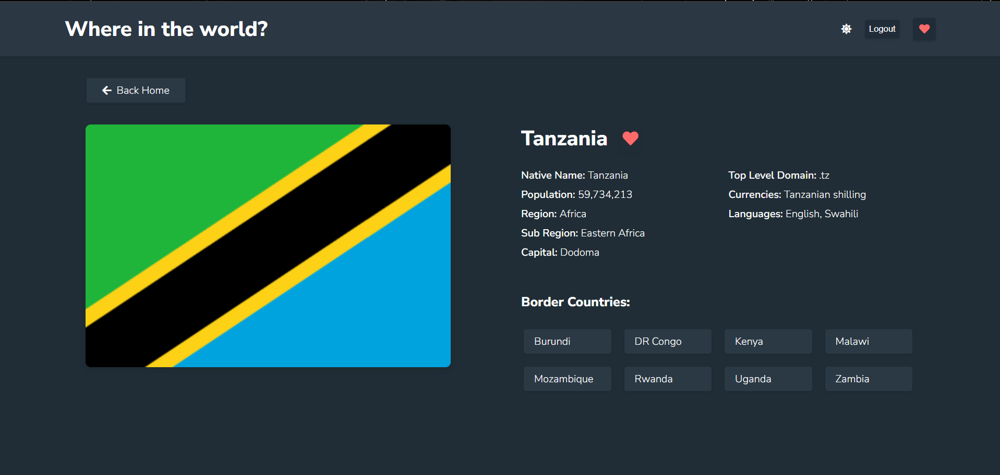
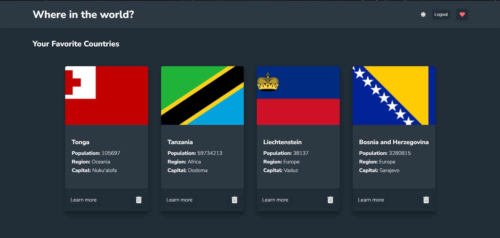
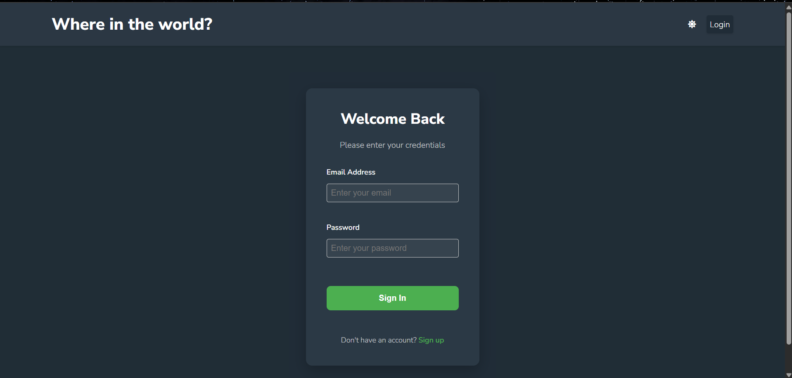
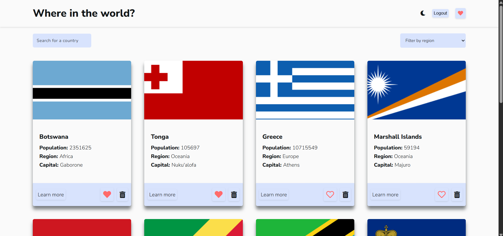
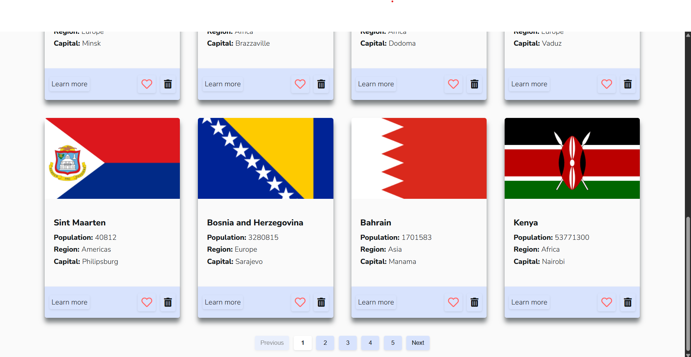
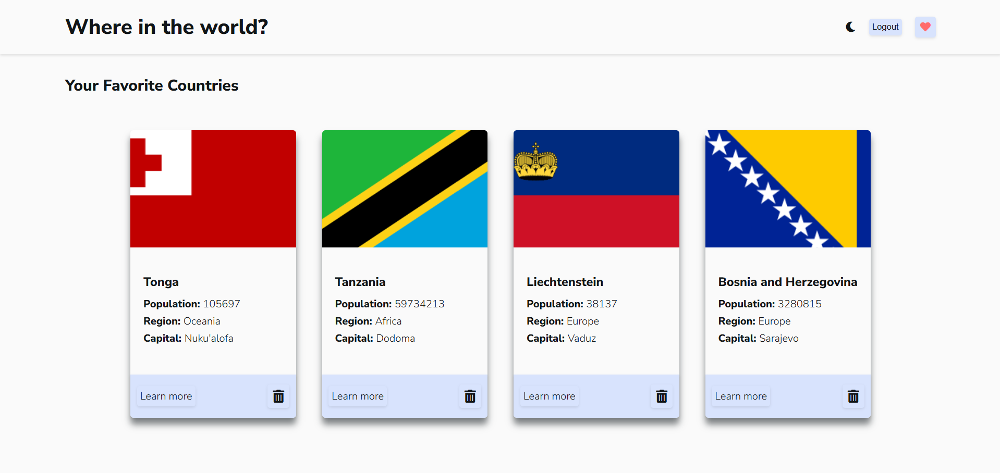
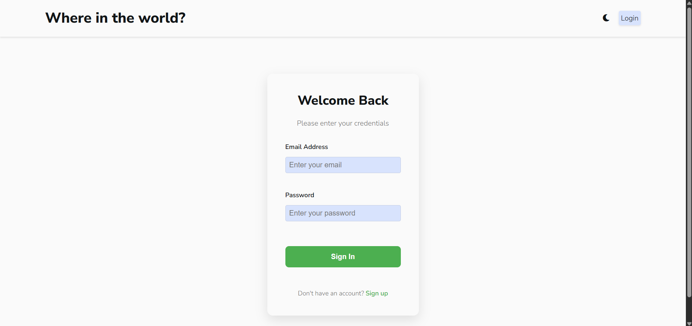

Project: Development of a React Frontend Application Using REST Countries API
URL of the hosted application: https://Tharushika251.github.io/Rest-Countries-API

# Country Explorer - React Application

A responsive React application for browsing country information using the REST Countries API, featuring search, filters, dark/light mode, and favorites functionality.

## Screenshots

## Dark Mode Screenshots

## Light Mode Screenshots

## Features

- Browse all countries with detailed information
- Search countries by name
- Filter by region (Africa, Americas, Asia, Europe, Oceania)
- Favorite countries (with user authentication)
- Dark/Light mode toggle
- Fully responsive design
- Paginated results for better performance

## Technologies Used

- React.js
- React Router
- REST Countries API
- Context API for state management
- CSS Modules for styling
- Jest/React Testing Library for testing

## Installation

### Prerequisites

- Node.js (v16 or later recommended)
- npm (v8 or later) or yarn

### Setup

1. Clone the repository: 

git clone https://github.com/SE1020-IT2070-OOP-DSA-25/af-2-IT22077110.git
cd country-explorer

2. Install dependencies:

`npm install`

3. Start the development server:
`npm start`

4. Open http://localhost:3000 in your browser.